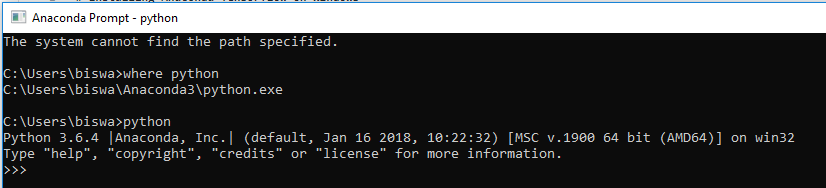

# Installing-Anaconda-Tensorflow-on-Windows
Step by Step guide to install Anaconda and Tensorflow on Windows Environment


## Step 1: Download and Installing Anaconda.

  * Go to : https://www.anaconda.com/downloads and download thye anaconda from the official website.

  * My recomend not to tick the check box. If you have multiple version of python then it might cause trouble.
    It will automatically configure the system environment path.So, If you don't tick then you have set manually the system environment.

    ```
      C:\Users\username\Anaconda3 and C:\Users\username\Anaconda3\Scripts
    ``` 
  
  


## Step 2: Installing Packages.

* Open Anaconda Command Prompt and check where the python is set or not in env Variable.

You can check by two command:

   ```
        where python
   ```
or
   ```
        python
   ```


If everything is fine then you can install the packages in Anaconda.

You can install packages by two ways: one creating a virtual environment or in the root.

To create a virtual environment: 
  ```
     conda create -n yourenvname python=x.x anaconda
  ```
Where x.x is python version like -> 3.4,3.6 etc.

then activate yourenvname to install packages
Command: 

 ```
      activate yourenvname
  ```
Now you can download the packages whatever you need for your project:

I'm adding some useful packages below:

  ```   
     conda install jupyter
     conda install conda 
     conda install scipy
     pip install sklearn
     pip install pandas
     pip install pandas-datareader
     pip install matplotlib
     pip install pillow
     pip install requests
     pip install h5py
   ```
## Installing Tensorflow and Keras.

For CPU version:

   ```
     pip install --ignore-installed --upgrade tensorflow
   ```
   if you only need some specific version :
   
       pip install tensorflow==1.4.0
       pip install keras==2.1.2

For GPU version:

     pip install --ignore-installed --upgrade tensorflow-gpu 

To Validate your installation:

Start a terminal.
Invoke python from your shell as follows:

      $python

then type the below code

    >>> import tensorflow as tf
    >>> hello = tf.constant('Hello, TensorFlow!')
    >>> sess = tf.Session()
    >>> print(sess.run(hello))

If the system outputs the following, then you are ready to begin writing TensorFlow programs:

   Hello, TensorFlow!
   
Congratulations! Tensorflow is sucessfully installed on your system.


## Installing OpenCV on Anaconda on Windows

 open anaconda prompt and type the below commands:

    pip install opencv-python
    pip install opencv-contrib-python

To make sure it is installed or not open python shell and type:
     
     import cv2 
     print(cv2.__version__)


## Error and Issues

1. If you get something like this:(FutureWarning):

  FutureWarning: Conversion of the second argument of issubdtype from `float` to `np.floating` is deprecated. In future, it will be       treated as `np.float64 == np.dtype(float).type`. from ._conv import register_converters as _register_converters 

then you need to install the latest version of h5py:

 ```
     pip install h5py==2.8.0rc1
 ```

2. Second error : 

    I C:\tf_jenkins\home\workspace\rel-win\M\windows\PY\36\tensorflow\core\platform\cpu_feature_guard.cc:137] Your CPU supports             instructions that this TensorFlow binary was not compiled to use: AVX AVX2.

 just import the below line at the beginning :
 
 ```
    import os
    os.environ["TF_CPP_MIN_LOG_LEVEL"]="3"
```


